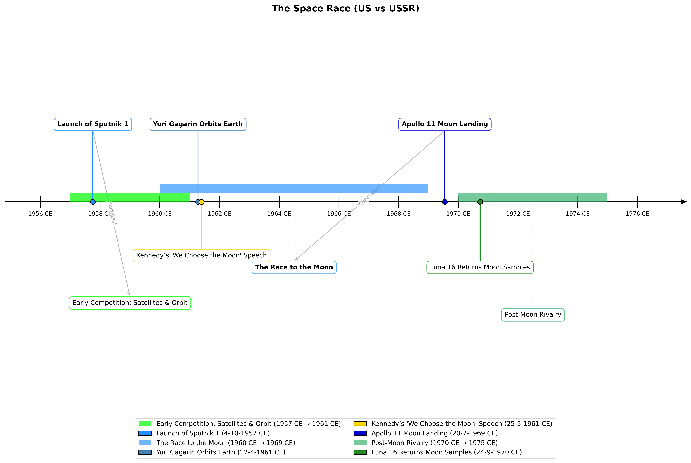

# Timeline DSL

A domain-specific language for creating and visualizing historical timelines with support for events, periods, and relationships.

## Features

- Define events and time periods with customizable properties
- Model relationships between timeline elements (cause-effect, contemporaneous, etc.)
- Support for various date formats (BCE/CE, full dates, relative calculations)
- Control structures for timeline manipulation (if, else, for loops)
- Export functionality for timeline integration

## Installation

1. Clone the repository:
```bash
git clone https://github.com/Ekkusuu/project-elsd.git
cd project-elsd
```

2. Create and activate a virtual environment:
```bash
python -m venv venv
# On Windows
.\venv\Scripts\activate
# On Unix or MacOS
source venv/bin/activate
```

3. Install dependencies:
```bash
pip install -r requirements.txt
```

## Usage

### Running the Web Application

1. Make sure your virtual environment is activated
2. Start the Flask development server:
```bash
python app.py
```
3. Open your web browser and navigate to: `http://127.0.0.1:5000/`

### Example Timeline Script

```dsl
event worldWar2End {
    title = "End of World War 2";
    date = 02-09-1945 CE;
    importance = high;
}

period coldWar {
    title = "Cold War";
    start = 1947 CE;
    end = 1991 CE;
    importance = high;
}

timeline modernHistory {
    title = "Modern History";
    worldWar2End, coldWar;
}

main {
    export modernHistory;
}
```

### Example Output



The visualization includes:
- Events marked as points on the timeline
- Periods shown as spans with start and end dates
- Color-coding based on importance levels
- Relationship indicators between elements

### Interface


The interface offers:
- A code editor (using Ace)
- Syntax highlighting
- Copy to clipboard and download functionality 

## Syntax Reference

### Date Formats
- Year only: `1945`, `356 BCE`
- Month-Year: `05-1945 CE`, `03-44 BCE`
- Full Date: `08-05-1945 CE`, `15-03-44 BCE`

### Keywords
- Timeline elements: `event`, `period`, `timeline`, `relationship`
- Control flow: `main`, `export`, `if`, `else`, `for`, `in`, `modify`
- Importance levels: `high`, `medium`, `low`
- Date notations: `BCE`, `CE`

For detailed syntax and grammar rules, please refer to [Grammar Definition](./src/TimelineParser.g4).
